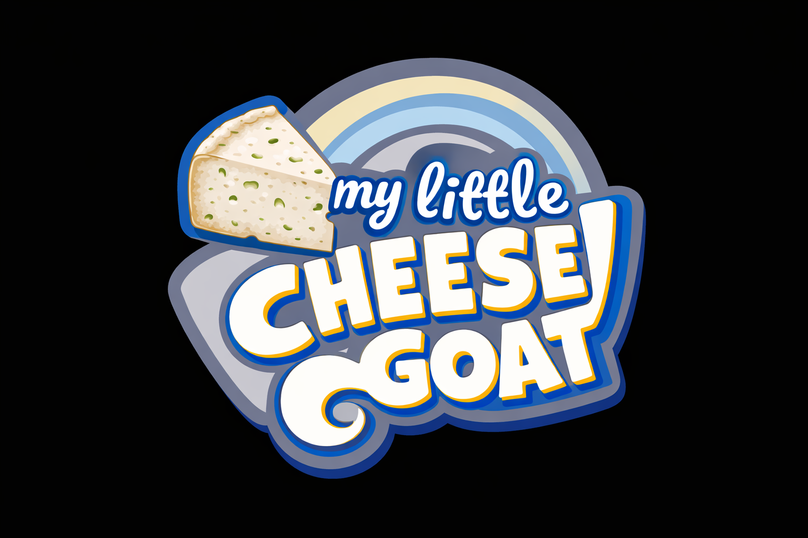

Tips for using this design doc
- Keep it concise: this page is for fast alignment and scope control - update only when a change affects the MVP.
- Use the MUST/SHOULD/MAY lists to decide tradeoffs; freeze MAYs early.
- Assign an owner for each MUST item and a 2‑hour timebox for any new experiment.
- Use placeholders for art/audio until gameplay is locked; artists polish only owned assets.
- When in doubt, ask: “Does this change the core loop?” If no, deprioritize.

## Design Document

Title: **My little cheese goat**

Logo: 

Title Candidates:
- Goat Slayer
- Midnight Goat
- Horns Up
- Goat & Jam
- Horns of Havoc
- Bloodhorn Harvest
- Horns of the Damned
- Night of the Red Horns
- Cheese of the Red Moon
- Cheese of the Luciferine Flame
- Bloodmoon Cheese
- My little cheese goat

Topic: Goat

One‑line pitch
- "A 3D isometric goat cheese making game, with defending against evil devil goats at night."

Core loop (what the player does, repeatedly)
- Make cheese with minigames during the day or optional at night.
- Defend against evil devil goats at night.

Target platforms
- Primary: PC (Windows)
- Secondary: Linux / macOS

Players
- Single player

Controls (draft)
- Movement: WASD
- Sprint: Shift
- Interact/Attack: Left click

## UI
Main menu:
- Pretty
- Play
- Quit

HUD:
- Milk & Cheese counter
- Time (Day/Night)
- Simple controls tutorial in corner

Win/Lose conditions
- Win: Make 10 cheese wheels.
- Lose: Time runs out OR player HP depletes OR all goats turned evil.

Visual & audio style (brief)
- Visual: Low‑poly + stylized lighting OR realistic with simple PBR (pick one).
- Audio: Day looping theme and night looping theme.

MUST (required for MVP - assign people)
- Core gameplay
    - Prototype and implement core mechanic (movement, jump, dash) - **Noah, Konsti**
    - Player camera (third‑person isometric) - **Noah, Konsti**
    - Goat milking - **Konsti**
    - Cheese making (interact with machines) - **Seli**   
    - Goat chases player - **Noah**
- Level
    - One complete playable 3D level and obstacles - **Seli, Nadine, Lea, Julian**
    - Level logic: spawn points, checkpoints, objective triggers - **Julian**
- Enemies/Obstacles
    - One enemy type or obstacle with simple behavior (patrol/triggered) - **Julian?**
- UI
    - Main menu, HUD with health/time/items - **Don, Lea**
    - win screen - **Viki**
- Audio
    - One looped background track integrated + 6 key SFX (jump, land, hit, enemy death, pickup, UI click) - **Philipp, Don?**
    - SFX:
      - player running loop (grass)
      - player take damage
      - goat bleat sound
      - goat milking sound (repeated)
      - cheese making background loop (bubbles?, stirring, fire place sounds)
      - day start sound (krähender hahn or rising melody)
      - night start sound (falling melody or spooky)
      - generic interact sound (button click, start minigame)
      - generic success sound (minigame hit, minigame success)
      - generic fail sound (minigame miss, minigame failed)
      - angry goat sound (chasing player)
      
      - konsti win whole game voice line
- Build & submission
    - Exportable build, icon, 3 screenshots, short description - **Max, Lea**
- Project infrastructure
    - Repository, scene organization, input mapping, basic build pipeline - **Max**
- 2D Assets:
    - main menu background - **Viki**
    - main menu buttons design
    - cheese piece - **Lea**
    - milk - **Lea**
    - heart - **Lea**
    - grayed out heart - **Lea**
- 3D Assets:
    - Farmer model - **Lea**
    - Goat model - **Nadine**
    - Evil Goat model - **Nadine**
    - farmhouse model - **Julian**
    - 2 tree models - **Julian**
    - fence models - **Julian**
    - cheese making station - **Nadine**
      - big pot filled with milk
      - working station(cutting board)
      - measuring cup with translucent white liquid
      - lemon
      - stirring animation
      - cheese wheel form

SHOULD (important but cuttable)
- Polished player model + basic animations (idle/run/sprint) - **Nadine**
- Extra goat behavior (charge attack) - **Nadine?, ?**
- Simple environmental props and basic lighting polish - **Lea, Don**
- Sound variations for enemy/player (hit, death) SFX - **Phlipp, ?**
- 2D Assets:
- 3D Assets:
  - farmer walk animation
  - farmer idle animation
  - goat walk animation
  - goat idle animation
  - goat milking animation
  - evil goat walk animation
  - evil goat idle animation
  - cheese wheel model - **Julian**
  - more tree models - **Julian**
  - bush models - **Julian**

MAY (nice‑to‑have; defer early)
